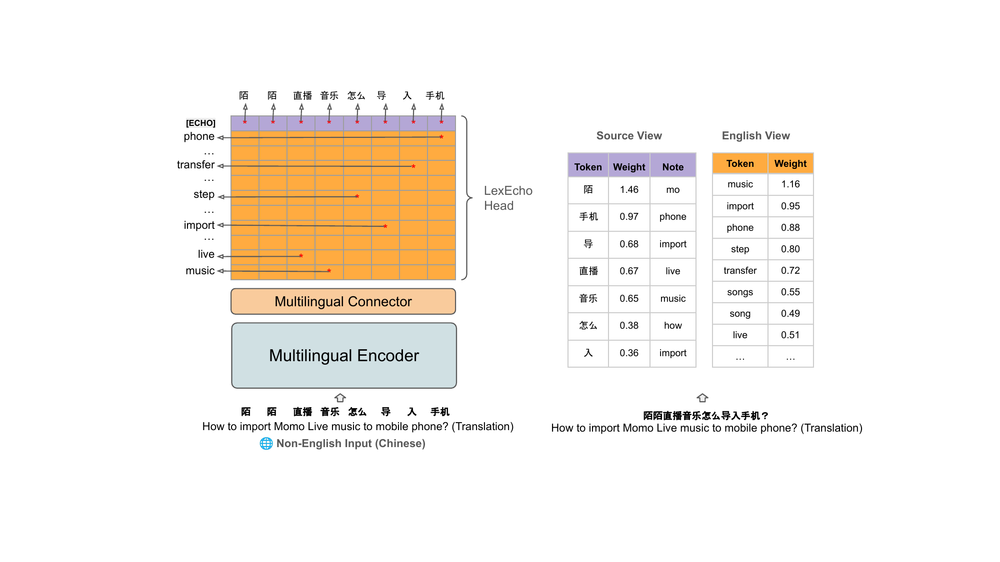
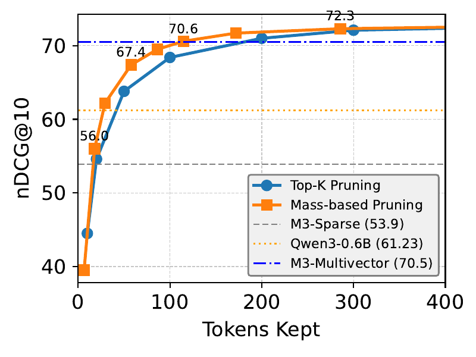

# Introducing MILCO: Learned Sparse Retrieval Across Languages

📄 [Paper (ICLR 2026)](https://openreview.net/forum?id=Z6dVYEqurT) · [arXiv](https://arxiv.org/abs/2510.00671) 🤗 [Model](https://huggingface.co/omai-research/milco-650m) 💻 [Code](https://github.com/thongnt99/milco)

Learned Sparse Retrieval (LSR) has a nice pitch: get the scalability of a bi-encoder and the transparency of lexical matching in one model. Each query and document becomes a sparse weighted bag of vocabulary terms, which plugs straight into an inverted index — readable, prunable, debuggable. [SPLADE](https://arxiv.org/abs/2107.05720) and its descendants showed this works well *in English*.

Pushing LSR beyond English is harder than it looks. Naively widening to the full multilingual vocabulary tends to cause **semantic collapse**: representations drift into ungrounded tokens, and the transparency that made LSR appealing disappears. Prior work splits the problem — [BGE-M3](https://arxiv.org/abs/2402.03216)'s sparse head was introduced but trained for monolingual retrieval only with limited effectiveness; [SPLADE-X](https://ceur-ws.org/Vol-3480/paper-06.pdf) and [BLADE](https://dl.acm.org/doi/10.1145/3539618.3591644) target cross-lingual retrieval one language pair at a time. A single LSR model that handles both, across many languages, is still an open direction.

**MILCO** is our take. One 560M model covers 39+ languages, maps queries and documents into a **shared English lexical space** via a multilingual connector, and produces inspectable `{token: weight}` outputs that drop straight into an inverted index. A small **LexEcho head** preserves the tail entities (proper nouns, code-switched terms) that the English projection would otherwise lose.

## Try it

In the output dicts below, `e_` prefixes are tokens in the shared English vocabulary (the pivot view); `m_` prefixes are source-script tokens emitted by the LexEcho head when an entity doesn't translate cleanly. Both views go through the same inverted index.

```python
from transformers import AutoModel

model = AutoModel.from_pretrained("omai-research/milco-650m", trust_remote_code=True)

docs = [
    "Baltimore: The Greatest City in America",
    "巴尔的摩：美国最伟大的城市",
    "Baltimore : La plus grande ville d'Amérique",
]

# Inspectable {token: weight} dicts
results = model.encode_text(docs, return_dict=True)
print(results[0])
# {'e_baltimore': 1.80, 'e_maryland': 1.25, 'e_city': 1.20,
#  'e_largest': 0.94, 'e_america': 0.89, 'e_usa': 0.86, ...}

# LexEcho dual view: English pivot + source-language echo
results = model.encode_text(["巴尔的摩：美国最伟大的城市"],
                            return_dict=True, source_view=True)
# {'e_baltimore': 1.65, 'e_city': 1.32, 'e_greatest': 1.12, ...,
#  'm_伟大的': 0.78, 'm_美国': 0.68, ...}

# Score with a sparse matmul
import torch
q = model.encode_query(["where is Baltimore?"])
d = model.encode_document(docs)
scores = torch.sparse.mm(q, d.t())
```

Same model handles English, Chinese, French, Arabic, Swahili, Telugu — no language flag, no per-language model. Different scripts produce similar lexical fingerprints.

## The core idea: collapse to English

Rather than widening the output space to cover every supported language, MILCO does the opposite — it collapses to a single pivot vocabulary (English) and lets a small connector do the upstream work.



The architecture has three pieces:

1. **Multilingual encoder** — a pretrained multilingual transformer (BGE-M3-unsupervised) that produces contextual embeddings for input in any supported language.
2. **Multilingual connector** — a lightweight projection that maps multilingual hidden states into the English MLM head's dimension.
3. **LexEcho head** — a dual-view sparse output head, described below.

Collapsing to English has a few practical benefits: one model handles many languages, cross-lingual matching falls out for free (a Chinese query and an English document end up in the same lexical space), and the output dimension is the English vocab (~30k) rather than a 250k multilingual one, which helps both training and index size.

## LexEcho: when English isn't enough

Projecting everything to English is clean — until you hit an entity that doesn't translate well. Proper nouns, brand names, code-switched terms, and entities that look different across languages (Douyin vs. TikTok, 陌陌 vs. Momo) tend to get lost in projection.

LexEcho produces two complementary views:

- **Pivot view** — max-pooled English MLM logits. This is the universal representation that enables cross-lingual matching.
- **Source view** — a special `[ECHO]` token in the MLM head scores each input token in its original script, so important source-language tokens get preserved alongside the English projection.

Take the figure above: the Chinese input "How to import Momo Live music to a mobile phone?" produces a clean English view (`music`, `import`, `phone`, `step`, `transfer`...) — but **Momo** (陌陌, a Chinese social app) has no clean English token, so the pivot view alone would silently miss any document that names the product. The source view echoes back `陌` with high weight, recovering the entity in its original script. When the English view captures what's needed, the source side stays quiet; when it doesn't, the echo is the fallback.

On [MIRACL](https://arxiv.org/abs/2210.09984), the LexEcho head adds **+4.2 nDCG@10 points on average**, with the largest gains in non-Latin scripts — Chinese (+8.1), Telugu (+6.8), Farsi (+6.5), Korean (+6.5), Japanese (+6.0) — which is roughly where you'd expect entity-name divergence to bite hardest.

## Training: alignment first, then contrastive

Putting a contrastive loss on this architecture directly didn't work for us — the model collapses to ungrounded tokens, the same way naive multilingual SPLADE training does. What worked is a two-stage recipe:

**Stage 1 — Sparse Alignment Pretraining (SAP).** For each parallel (non-English, English) sentence pair, encode the English side with a strong English LSR teacher ([SPLADE-v3](https://arxiv.org/abs/2403.06789)) and train MILCO to match that sparse target on the non-English side. We use a **Sparse-aware MSE** loss that only counts coordinates where either student or teacher is non-zero — this focuses the gradient on the lexical terms that actually matter rather than diluting it across the (mostly zero) vocabulary. Parallel sentence data is much more abundant than labeled multilingual relevance data, which makes SAP cheap to scale.

**Stage 2 — Sparse Contrastive Training (SCT).** With the model grounded in English vocabulary, we fine-tune on retrieval data using KL distillation from a cross-encoder teacher (BGE-Reranker-v2.5), plus L1 regularization to keep the representations sparse.

Both stages matter. Without SAP, contrastive training collapses the representation. Without SCT, you get grounded but mediocre retrieval. Together, they produce models that are both transparent and effective.

## Results on MIRACL (18 languages)

MILCO (560M) reaches 72.3 nDCG@10 on MIRACL. For reference:

| Model | Size | nDCG@10 |
|---|---|---|
| BGE-M3 Sparse | 560M | 53.9 |
| BGE-M3 Dense | 560M | 69.2 |
| BGE-M3 Dense+Sparse+Multivector (ensemble) | 560M | 71.5 |
| Qwen3-Embed 0.6B | 0.6B | 60.5 |
| Qwen3-Embed 8B | 7.6B | 69.8 |
| **MILCO** | **560M** | **72.3** |

We were a bit surprised that a 560M sparse model could be competitive with much larger dense models on this benchmark — though the gaps narrow on other benchmarks, and Qwen3 8B in particular does better on [MTEB v2](https://arxiv.org/abs/2210.07316) where it can use task-specific instructions.

We also evaluated on **[MLDR](https://huggingface.co/datasets/Shitao/MLDR)** (long documents), **MTEB v2** (39 languages), **[BEIR](https://arxiv.org/abs/2104.08663)**, and **[LIMIT](https://arxiv.org/abs/2508.21038)**. Full numbers are in the [paper](https://arxiv.org/abs/2510.00671) — the short version is that MILCO is competitive across the board.

### Cross-lingual for free

One result worth pulling out: on **[MKQA](https://arxiv.org/abs/2007.15207)**, MILCO reaches **R@100 of 76.6** zero-shot — meaning a query in any of MKQA's source languages retrieves the relevant English document. MILCO was never trained on cross-lingual relevance data. The shared-English vocabulary makes cross-lingual matching fall out for free: a non-English query and an English document land in the same lexical space by construction. For teams who have monolingual relevance data but want cross-lingual search, this is the headline.

## Retrieval Efficiency: Pay only for the tokens you need

One nice property of sparse representations is that they support **post-hoc pruning** without any auxiliary training objectives. This is similar in spirit to [Matryoshka representation learning](https://arxiv.org/abs/2205.13147) — both let you trade effectiveness for efficiency at inference time — but with LSR you get it for free: no nested-dimension loss, no special training recipe. You just keep the top-weighted tokens per document at index time and pick whatever budget you want. Sparse representations also support **variable-length** truncation (longer documents can keep more tokens, shorter ones fewer), whereas Matryoshka enforces the same dimension budget for everything.



Two observations from the curve:

- Mass-based pruning (orange) consistently outperforms top-K pruning (blue) — letting documents have a variable number of tokens is a better trade than enforcing a fixed budget.
- Even fairly aggressive pruning holds up: ~30 tokens per document is enough to surpass Qwen3-Embed 0.6B (1024-dim dense), and ~120 tokens roughly matches the BGE-M3 multi-vector ensemble.

On the MIRACL English subset (~32M passages), this shows up as a clean win on both fronts vs. a similarly-sized dense baseline:

| Model | Index | Avg latency | QPS | nDCG@10 |
|---|---|---|---|---|
| Qwen3-Embed 0.6B (dense, Faiss HNSW) | 134 GB | 1.29 ms | 777 | 50.4 |
| MILCO, unpruned (Seismic) | 61 GB | 1.85 ms | 538 | 56.4 |
| MILCO, mass-pruned (~30 tokens/doc) | 25 GB | 0.61 ms | 1647 | 54.4 |
| MILCO, aggressive pruning | 12 GB | 0.44 ms | 2265 | 50.3 |

At ~30 tokens/doc MILCO is ~5× smaller and ~2× faster than Qwen3-Embed 0.6B while scoring 4 points higher. Push pruning further and the index shrinks ~11×, QPS roughly triples, and effectiveness still matches the dense baseline. The knob is "how much mass to keep per document" — pick whatever fits your latency and storage budget.

## Using MILCO in your stack

Because the output is a `{token: weight}` dict over the ~30k English vocabulary, MILCO drops into any system that already understands inverted indexes:

- **Sparse retrieval backends** — Pyserini / Anserini, [Seismic](https://github.com/TusKANNy/seismic) (used for the numbers above), or any Lucene-based store with sparse term support.
- **General search engines** — OpenSearch, Elasticsearch, and Vespa can host MILCO vectors as weighted term queries (rank-features / term-vector fields).

A typical deployment recipe: encode documents with `encode_document(...)`, mass-prune to your budget (start with ~120 tokens/doc as a near-lossless default, drop toward 30 if storage is tight), and write the surviving `(token, weight)` pairs as your index payload. Queries go through `encode_query(...)`. Because tokens are readable English words, you can `print()` your index entries and they will tell you what they think a document is about.

## Wrapping up

MILCO is a step toward LSR that scales beyond English without losing the things that make sparse retrieval useful: transparency, inverted-index compatibility, and post-hoc efficiency control.

**Reach for it when** you need multilingual or cross-lingual search, you want an inspectable index, or you're trying to fit retrieval into a small storage / latency budget where a 100+ GB dense index is a non-starter.

**On language coverage**, we trained and evaluated on 39 languages, but the underlying multilingual encoder supports many more.  You can improve MILCO to additional languages by fine-tuning the model on your target language data as instruced in our codebase. 

Open directions we're interested in: stronger connectors, larger backbones, broader language coverage, and tighter integration with agentic systems where multilingual/cross-lingual information access is critical. Code, checkpoints, and the paper are linked at the top — we'd love to see what people build with it.

## Citation

```bibtex
@inproceedings{nguyen2026milco,
  title={MILCO: Learned Sparse Retrieval Across Languages via a Multilingual Connector},
  author={Nguyen, Thong and Lei, Yibin and Ju, Jia-Huei and Yang, Eugene and Yates, Andrew},
  booktitle={International Conference on Learning Representations},
  year={2026}
}
```